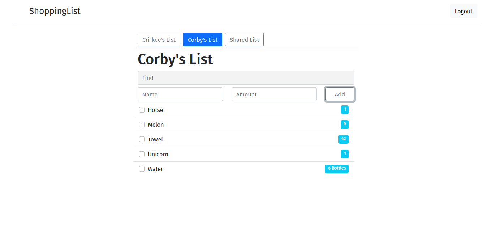

# shoppinglist
A simple shoppinglist webapp written in Golang and vuejs

This webapp solves my need for shoppinglist which is synced between different devices and I share with other people.
It is intended to be as simple as possible while providing a good user experience.

The vuejs code is ~~probably~~ awful. Please give me some feedback if you have any tips for improvements. I'm learning as I go.
Also I'd rather have something awful than not having anything at all.

Todo:
* User accounts
* Private and shared lists
* Offline on device storage/caching (The internet connection in some stores is aweful)
